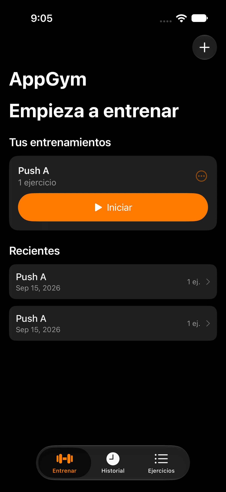

# AppGym

Repo: https://github.com/ndelorte/gymkit

MVP v0.1 personal, local, offline gym-tracking app for iPhone. Swift, SwiftUI,
SwiftData, Swift Charts. No backend, no accounts, no cloud sync.

## Status

v0.1 MVP, in personal use for real-world feedback before scoping v2. Known
issues and v2 candidates get tracked as they come up — see
`docs/PRODUCT_DECISIONS.md` for decisions made so far and open questions.

## Layout

- `AppGymKit/` — local Swift package with the SwiftData models and all domain
  logic (session lifecycle, previous-session lookup, PR calculation, backup).
  Has its own fast test suite (`swift test`, no simulator required).
- `AppGym/` — the SwiftUI app target. Thin: views read/write `AppGymKit`
  models directly through `@Query`/`@Environment(\.modelContext)`.
- `AppGymUITests/` — one end-to-end UI test covering the core acceptance
  scenario (create → run → finish → relaunch → previous-value preload → PR).
- `project.yml` — [XcodeGen](https://github.com/yonaskolb/XcodeGen) spec. The
  `.xcodeproj` is generated, not hand-edited — run `xcodegen generate` after
  changing `project.yml` or adding/removing source files.

See `docs/ARCHITECTURE.md` for the domain model and key invariants, and
`docs/DEVELOPMENT.md` for build/test/run commands.
